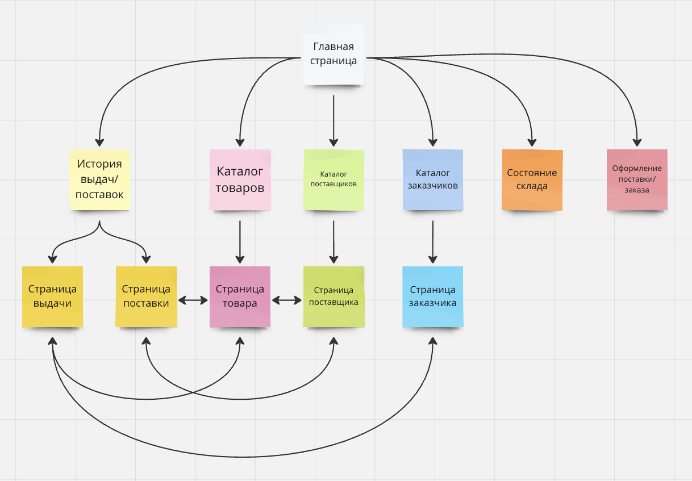
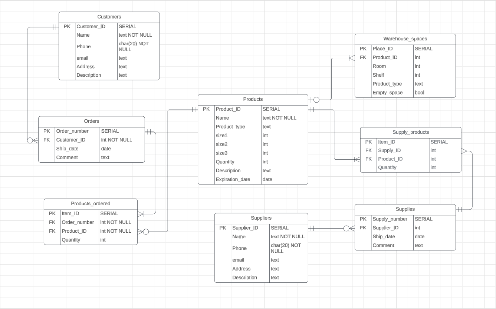

# web_dev
CMC MSU: Web Development, Spring 2024

Складской учет
=======================
Описание страниц
-----------------
На каждой странице есть доступ к меню страниц.

Меню страниц:
- Ссылка на главную страницу
- Ссылка на страницу истории поставок и выдач
- Ссылка на страницу с каталогом товаров
- Ссылка на страницу с каталогом поставщиков
- Ссылка на страницу с каталогом заказчиков
- Ссылка на страницу состояния склада
### Главная страница

На главной странице есть следующие кнопки: 
- "Сформировать заказ" и "Сформировать поставку"
- "Добавить товар" 
- "Добавить заказчика" и "Добавить поставщика"

### История поставок и выдач
Список карточек - быстрая информация о поставке или выдаче. Возможен поиск с фильтрацией, сортировка.
Сортировка возможна по следующим параметрам: дата, количество товаров, наименование поставщика/заказчика и т.д. 
Фильтрация возможна по периоду времени.

### Каталог товаров
Поиск товара по имени с возможностью сортировки по различным параметрам. Список найденных товаров - их карточки с быстрой информацией, по нажатию на которые происходит переход на страницу товара.
Сортировка возможна по следующим параметрам: количество товара в наличии, срок годности товара, название товара (в алфавитном порядке).

### Страница товара
Количество в наличии, сроки хранения, габариты, место на складе и т. д.
Все данные, кроме мест хранения, можно редактировать, нажав кнопку "Редактировать". Далее необходимо внести изменения и нажать кнопку "Подтвердить изменения".

### Каталог поставщиков
Поиск поставщика по наименованию с возможностью сортировки по различным параметрам. Список найденных поставщиков - их карточки с быстрой информацией, по нажатию на которые происходит переход на страницу поставщика.
Сортировка возможна по следующим параметрам: имя поставщика (в алфавитном порядке), общее количество поставок за последний год, общее количество поставок за все время.

### Страница поставщика
Наименование, контактная информация, описание, последние поставки и т. д.
Наименование и контактную информацию можно редактировать, нажав кнопку "Редактировать". Далее необходимо внести изменения и нажать кнопку "Подтвердить изменения".
Все упоминания ближайших поставок - ссылки на конкретную поставку.

### Каталог заказчиков
Поиск заказчика по наименованию с возможностью сортировки по различным параметрам. Список найденных заказчиков - их карточки с быстрой информацией, по нажатию на которые происходит переход на страницу заказчика.
Сортировка возможна по следующим принакам: имя заказчика (в алфавитном порядке), количество заказов за все время, количество заказов за последний год.

### Страница заказчика
Наименование, контактная информация, описание, последние заказы и т. д. 
Наименование и контактную информацию можно редактировать, нажав кнопку "Редактировать". Далее необходимо внести изменения и нажать кнопку "Подтвердить изменения".
Все упоминания ближайших заказов - ссылки на конкретный заказ.

### Страница поставки
Дата и время поставки, список товаров, поставщик, и т. д. 
Все данные можно редактировать, нажав кнопку "Редактировать". Далее необходимо внести изменения и нажать кнопку "Подтвердить изменения".
Наименование поставщика - ссылка на его страницу. Товары в списке - ссылки на страницы самих товаров.

### Страница заказа
Дата и время выдачи, список товаров, заказчик и т. д.
Все данные можно редактировать, нажав кнопку "Редактировать". Далее необходимо внести изменения и нажать кнопку "Подтвердить изменения".
Наименование заказчика - ссылка на его страницу. Товары в списке - ссылки на страницы самих товаров.

### Страница формирования и оформления заказа или поставки
Форма с обязательными и необязательными полями
Например: дата и время выдачи/поставки, информация о заказчике/поставщике, товарах и т.д. Возможно добавление встроенной проверки наличия товаров или свободного места на складе. Для каждого товара - выбор ячейки. Кнопка подтверждения формирования выдачи/поставки.

### Страница состояния склада
Перечисление свободных ячеек разных типов. Форма для проверки наличия свободного места.

Схема базы данных
-----------------

Сценарии использования
----------------------
- Получение списка имеющихся товаров по видам, сроку хранения, поставщику и пр.
  - Перейти на страницу каталога товаров, нажав на заголовок из главного меню.
  - Выбрать нужный способ сортировки.
  - Нажать кнопку "Поиск".

- Получение данных о поставках и выдачах за заданный период времени
  - Перейти на страницу истории поставок и выдач, нажав на заголовок из главного меню.
  - Выбрать нужные фильтры и способ сортировки.
  - Нажать кнопку "Поиск".

- Оформление поставки или выдачи
  - Перейти на страницу оформления поставок и выдач из главного меню.
  - Заполнить все обязательные поля и необязательные поля по необходимости. 
  - Нажать кнопку "Подтвердить оформление".

- Проверка наличия свободного места для поставки
  - Перейти на страницу состояния склада, нажав на заголовок из главного меню.
  - Заполнить форму.
  - Нажать кнопку "Проверить наличие места".

- Добавление и удаление товара, чтение и редактирование данных о нем
  - Перейти на страницу каталога товаров из главного меню.
  - Найти необходимый товар.
  - Перейти на страницу товара, нажав на его карточку.
  - Нажать кнопку "Изменить".
  - Внести изменения.
  - Нажать кнопку "Сохранить изменения" или "Удалить товар".

- Добавление и удаление поставщиков и потребителей, чтение и редактирование данных о них
  - Перейти на страницу каталога поставщиков или потребителей из главного меню.
  - Найти необходимого поставщика или потребителя.
  - Перейти на страницу поставщика или потребителя, нажав на его карточку.
  - Нажать кнопку "Изменить".
  - Внести изменения.
  - Нажать кнопку "Сохранить изменения" или "Удалить поставщика/потребителя".